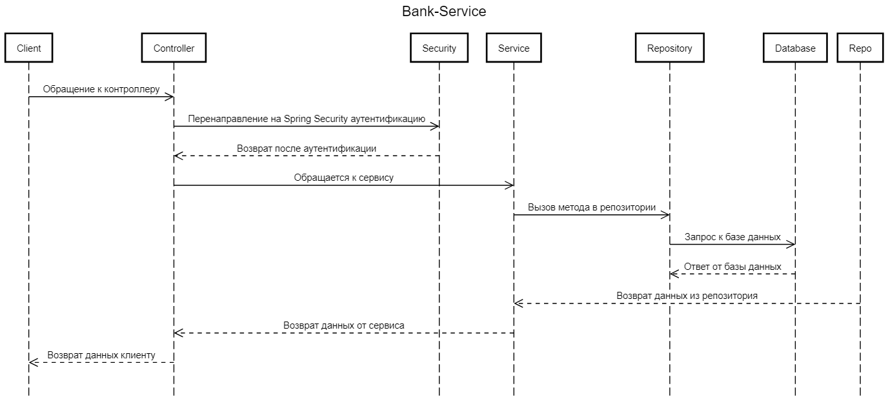
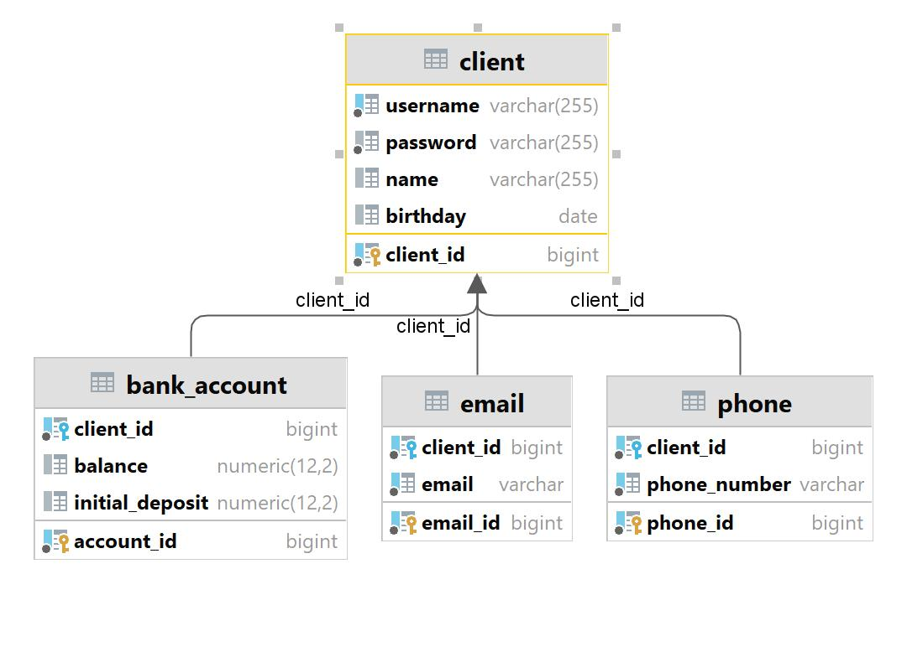

# Bank-Service

Этот сервис ведет учет клиентов и их контактных данных, а так же позволяет осуществлять транзакции между клиентами переводя денежные средства со счетов клиентов.

В сервисе реализованы потоко-безопасные транзакции в соответствии с принципами ACID.

**У каждого клиента имеются следующие данные:**
* логин
* пароль
* Фамилия, Имя, Отчество
* Дата рождения
* Список контактных телефонов
* Список контактных email - адресов.
* Банковский аккаунт

**Для клиентов установленны следующие ограничения**
* Клиент не может иметь менее одного номера телефона
* Клиент не может иметь менее одного email - адреса
* Клиент не может иметь отрицательный баланс на банковском аккаунте

**Дополнительные условия**
* Каждую минуту насчет клиента начисляются проценты равные 5% от остатка на лицевом счете
* Начисляемые проценты не могут превысить 207% от начального депозита

**В сервисе реализованны следующие api:**

Защищенные с использованием Spring Security:

---
* Client API - осуществляет работу с клиентами. В том числе Изменение контактных данных, получение списка клиентов, получение конкретного клиента.
* Search API - осуществляет выборку клиентов, по возрасту, телефону, имени, email. Поддерживает пагинацию и сортировку для запросов с множеством клиентов.

Без защиты Spring Security:

---
* Auth API - осуществляет аутентификацию клиентов.
* Admin API - добавляет новых клиентов в сервис.

В качестве защиты сервис использует аутентификацию при помощи JWT токенов.

Доплнительно в сервисе реализованно логирование ключевых этапов:
* фиксация обрабатываемых исключений
* создание новых пользователей

# Запуск сервиса
#### Для запуска локально
* Так как данный сервис реализован с использованием базы данных PostgreSQL, пожалуйста убедитесь, что на вашем устройстве имеется данная СУБД.
* Создайте базу данных **bank-api**
* Убедитесь в корректности данных файла .env, в которых указаны логин и пароль для доступа к СУБД

#### Для запуска в контейнере
* В файле .env следует изменить путь для доступа к базе данных **HOST=localhost** на **HOST=db**.
* Соберите проект, для генерации файлов в дериктории target. Можно воспользоваться командой **mvn clean install -DskipTests**
* Введите в командной строке, в корне проекта команду **docker compose up**

В сервисе реализованы два пользователя по умолчанию:
* логин - ivan11, пароль - 123
* логин - serg22, пароль - 123

Вы можете получить доступ к Swagger и просмотреть все доступные конечные точки, посетив `http://localhost:8080/swagger-ui/index.html`

## Sequence diagram

## ERD diagram

